# react-todolist


## Summary
return [Summary](#summary)

<!-- TOC -->

- [react-todolist](#react-todolist)
  - [Summary](#summary)
  - [Getting Started with Create React App](#getting-started-with-create-react-app)
    - [Available Scripts](#available-scripts)
      - [`npm start`](#npm-start)
      - [`npm test`](#npm-test)
      - [`npm run build`](#npm-run-build)
      - [`npm run eject`](#npm-run-eject)
    - [Learn More](#learn-more)
      - [Code Splitting](#code-splitting)
      - [Analyzing the Bundle Size](#analyzing-the-bundle-size)
      - [Making a Progressive Web App](#making-a-progressive-web-app)
      - [Advanced Configuration](#advanced-configuration)
      - [Deployment](#deployment)
      - [`npm run build` fails to minify](#npm-run-build-fails-to-minify)
  - [Setup](#setup)
    - [install nodejs](#install-nodejs)
    - [version verification](#version-verification)
    - [install json-server](#install-json-server)
    - [Setup 故障排除 - Trouble Shooting](#setup-故障排除---trouble-shooting)
  - [AWS](#aws)
    - [Amazon API Gateway](#amazon-api-gateway)
    - [Step 1: Create a DynamoDB table](#step-1-create-a-dynamodb-table)
    - [Step 2: Create a Lambda function](#step-2-create-a-lambda-function)
    - [Step 3: Create an HTTP API](#step-3-create-an-http-api)
    - [Step 4: Create routes](#step-4-create-routes)
    - [Step 5: Create an integration](#step-5-create-an-integration)
    - [Step 6: Attach your integration to routes](#step-6-attach-your-integration-to-routes)
    - [Step 7: Test your API](#step-7-test-your-api)
    - [AWS 故障排除 - Trouble Shooting](#aws-故障排除---trouble-shooting)
  - [Reference](#reference)

<!-- /TOC -->

-----


## Getting Started with Create React App

This project was bootstrapped with [Create React App](https://github.com/facebook/create-react-app).

### Available Scripts

In the project directory, you can run:

#### `npm start`

Runs the app in the development mode.\
Open [http://localhost:3000](http://localhost:3000) to view it in your browser.

The page will reload when you make changes.\
You may also see any lint errors in the console.

#### `npm test`

Launches the test runner in the interactive watch mode.\
See the section about [running tests](https://facebook.github.io/create-react-app/docs/running-tests) for more information.

#### `npm run build`

Builds the app for production to the `build` folder.\
It correctly bundles React in production mode and optimizes the build for the best performance.

The build is minified and the filenames include the hashes.\
Your app is ready to be deployed!

See the section about [deployment](https://facebook.github.io/create-react-app/docs/deployment) for more information.

#### `npm run eject`

**Note: this is a one-way operation. Once you `eject`, you can't go back!**

If you aren't satisfied with the build tool and configuration choices, you can `eject` at any time. This command will remove the single build dependency from your project.

Instead, it will copy all the configuration files and the transitive dependencies (webpack, Babel, ESLint, etc) right into your project so you have full control over them. All of the commands except `eject` will still work, but they will point to the copied scripts so you can tweak them. At this point you're on your own.

You don't have to ever use `eject`. The curated feature set is suitable for small and middle deployments, and you shouldn't feel obligated to use this feature. However we understand that this tool wouldn't be useful if you couldn't customize it when you are ready for it.

### Learn More

You can learn more in the [Create React App documentation](https://facebook.github.io/create-react-app/docs/getting-started).

To learn React, check out the [React documentation](https://reactjs.org/).

#### Code Splitting

This section has moved here: [https://facebook.github.io/create-react-app/docs/code-splitting](https://facebook.github.io/create-react-app/docs/code-splitting)

#### Analyzing the Bundle Size

This section has moved here: [https://facebook.github.io/create-react-app/docs/analyzing-the-bundle-size](https://facebook.github.io/create-react-app/docs/analyzing-the-bundle-size)

#### Making a Progressive Web App

This section has moved here: [https://facebook.github.io/create-react-app/docs/making-a-progressive-web-app](https://facebook.github.io/create-react-app/docs/making-a-progressive-web-app)

#### Advanced Configuration

This section has moved here: [https://facebook.github.io/create-react-app/docs/advanced-configuration](https://facebook.github.io/create-react-app/docs/advanced-configuration)

#### Deployment

This section has moved here: [https://facebook.github.io/create-react-app/docs/deployment](https://facebook.github.io/create-react-app/docs/deployment)

#### `npm run build` fails to minify

This section has moved here: [https://facebook.github.io/create-react-app/docs/troubleshooting#npm-run-build-fails-to-minify](https://facebook.github.io/create-react-app/docs/troubleshooting#npm-run-build-fails-to-minify)


-----


## Setup
return [Summary](#summary)

### install nodejs

```shell
nvm install 16.15.0
nvm use 16.15.0
```

> nvm use 版本報錯，出現exit status 1後面跟一堆亂碼<br>
> 此時是因為無權限，以管理員身份打開，再次使用nvm use，問題解決


### version verification

```shell
# nvm version
1.1.8

# node -v
v16.15.0


```


### install json-server
```
# 首先全域安裝 json-server
npm install -g json-server

# 開啟 json server，並且指定使用哪個檔案
json-server db.json
```


使用 React 建立一個全新的 single-page 應用程式
Node >= 14.0.0 and npm >= 5.6

```
npx create-react-app react-todolist
cd react-todolist
npm start
```


### Setup 故障排除 - Trouble Shooting
return [Summary](#summary)

出現 `'React' must be in scope when using JSX  react/react-in-jsx-scope` 錯誤
最上面加入下面這行就解決了
```
import React from 'react';
```


## AWS
return [Summary](#summary)


### Amazon API Gateway

<https://docs.aws.amazon.com/apigateway/latest/developerguide/getting-started.html>
<https://docs.aws.amazon.com/apigateway/latest/developerguide/http-api-dynamo-db.html>

### Step 1: Create a DynamoDB table
return [Summary](#summary)

**1. Open the DynamoDB console at <https://console.aws.amazon.com/dynamodb/>**

| Name | Value |
| - | - |
| Table name | todolist-items |
| Partition key | id |
| Tag name | Name |
| Tag value | react-todolist_todolist-items |

**2. Choose `Create table`**

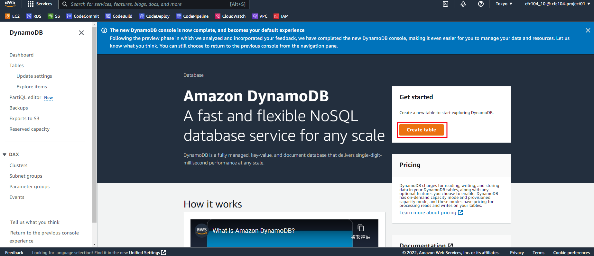

**3. For `Table name`, enter `todolist-items`, For `Partition key`, enter `id`**


**4. add Tag, Choose `Create`**

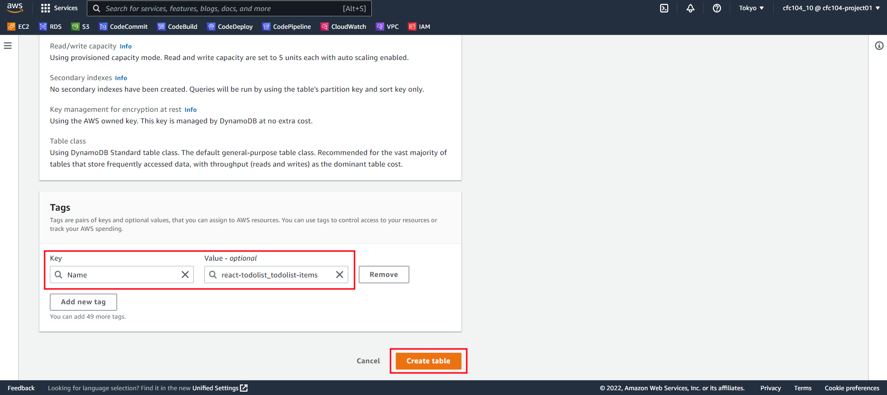

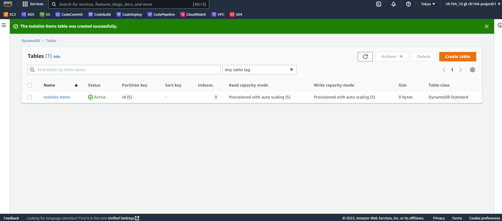

-----

### Step 2: Create a Lambda function
return [Summary](#summary)

**1. Sign in to the Lambda console at https://console.aws.amazon.com/lambda**

| Name | Value |
| - | - |
| Function name | todolist-function |
| Role name | todolist-role |
| Policy templates | Simple microservice permissions |


**2. Choose Create function**

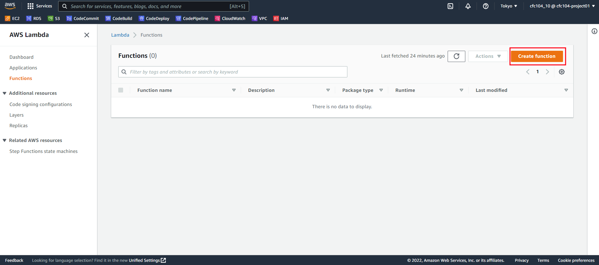


**3. For `Function name`, enter `todolist-function`.**
**4. Under `Permissions` choose `Change default execution role`.**
**5. Select `Create a new role from AWS policy templates`.**
**6. For Role name, enter `todolist-role`.**
**7. For `Policy templates`, choose `Simple microservice permissions`. This policy grants the Lambda function permission to interact with DynamoDB.**
**8. Choose `Create function`**
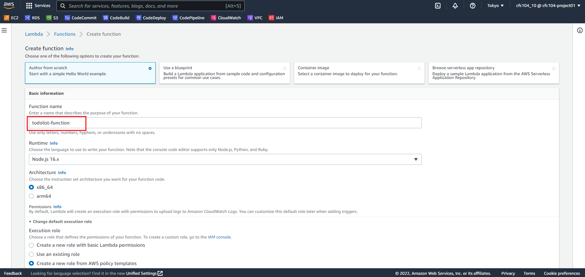

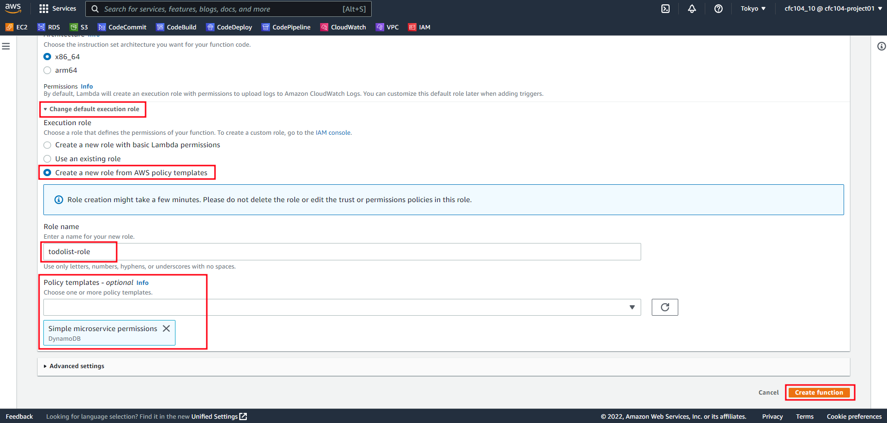

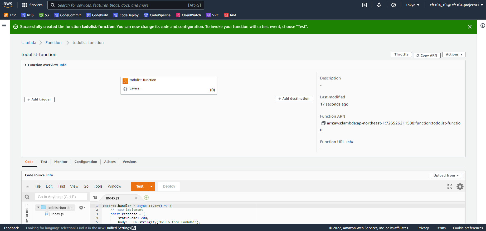


**9. Open `index.js` in the console's code editor, and replace its contents with the following code. Choose `Deploy` to update your function**

```
const AWS = require("aws-sdk");

const dynamo = new AWS.DynamoDB.DocumentClient();

exports.handler = async (event, context) => {
  let body;
  let statusCode = 200;
  const headers = {
    "Content-Type": "application/json"
  };

  try {
    switch (event.routeKey) {
      case "DELETE /items/{id}":
        await dynamo
          .delete({
            TableName: "todolist-items",
            Key: {
              id: event.pathParameters.id
            }
          })
          .promise();
        body = `Deleted item ${event.pathParameters.id}`;
        break;
      case "GET /items/{id}":
        body = await dynamo
          .get({
            TableName: "todolist-items",
            Key: {
              id: event.pathParameters.id
            }
          })
          .promise();
        break;
      case "GET /items":
        body = await dynamo.scan({ TableName: "todolist-items" }).promise();
        break;
      case "PUT /items":
        let requestJSON = JSON.parse(event.body);
        await dynamo
          .put({
            TableName: "todolist-items",
            Item: {
              id: requestJSON.id,
              price: requestJSON.price,
              name: requestJSON.name
            }
          })
          .promise();
        body = `Put item ${requestJSON.id}`;
        break;
      default:
        throw new Error(`Unsupported route: "${event.routeKey}"`);
    }
  } catch (err) {
    statusCode = 400;
    body = err.message;
  } finally {
    body = JSON.stringify(body);
  }

  return {
    statusCode,
    body,
    headers
  };
};
```

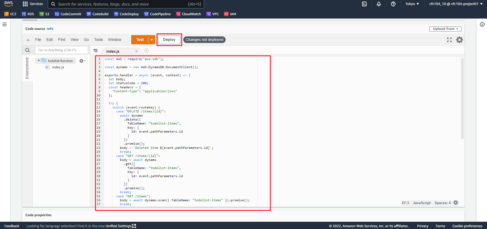

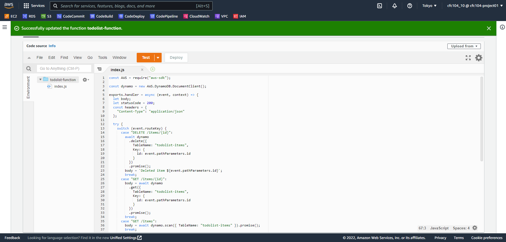

-----

### Step 3: Create an HTTP API
return [Summary](#summary)

**1. Sign in to the API Gateway console at <https://console.aws.amazon.com/apigateway>.**

**2. Choose `Create API`, and then for `HTTP API`, choose `Build`.**

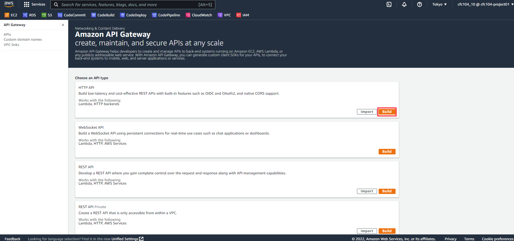

**3. For API name, enter `todolist-api`.**

**4. Choose `Next`.**

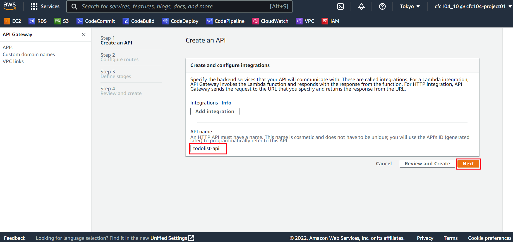

**5. For `Configure routes`, choose `Next` to skip route creation. You create routes later.**

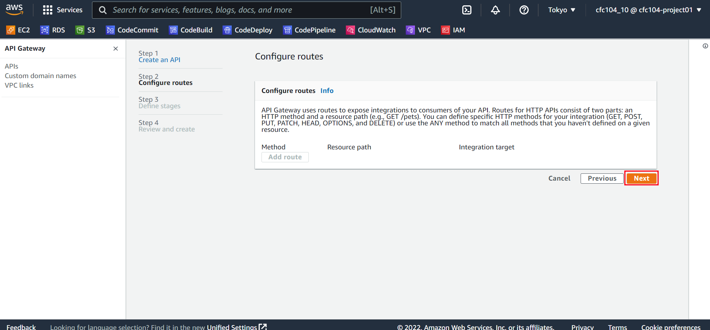

**6. Review the stage that API Gateway creates for you, and then choose `Next`.**

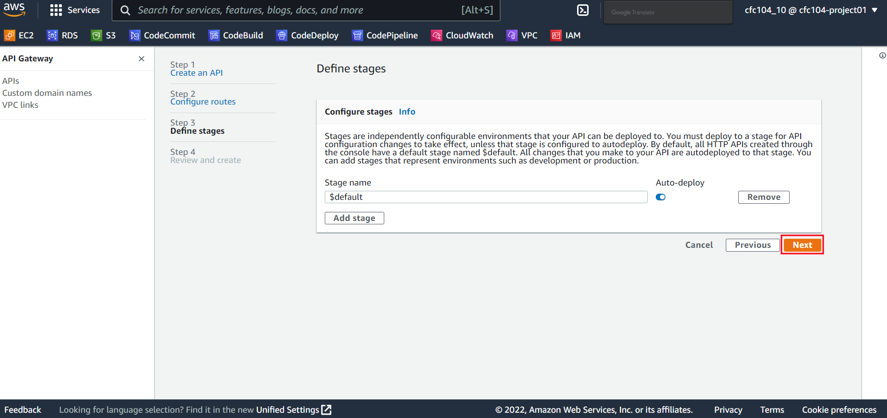

**7. Choose `Create`.**

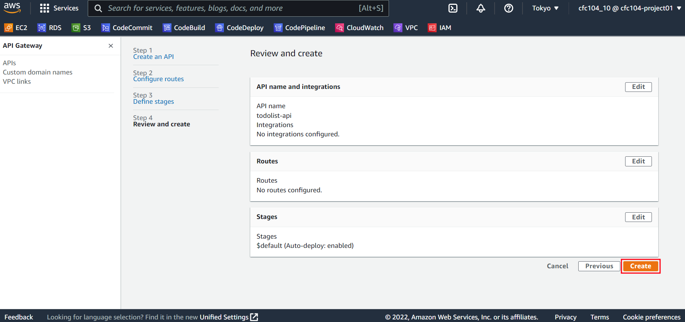

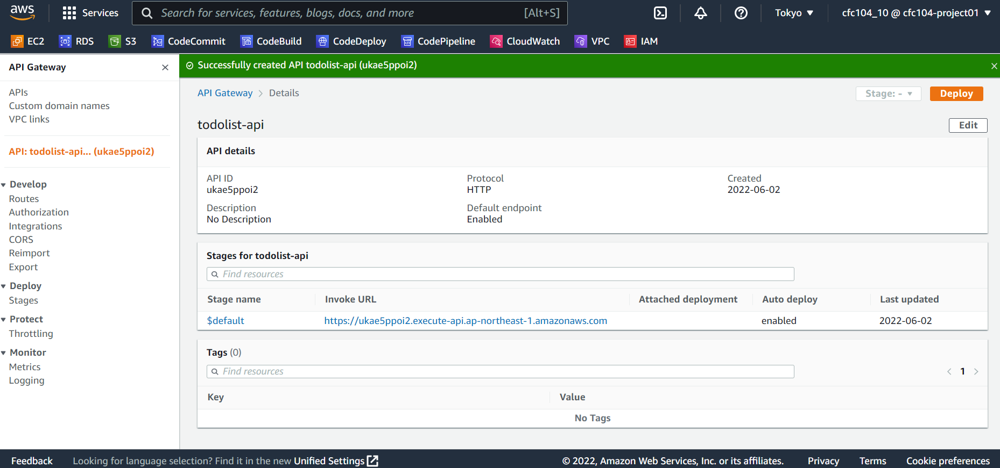


-----

### Step 4: Create routes
return [Summary](#summary)

> Routes are a way to send incoming API requests to backend resources. Routes consist of two parts: an HTTP method and a resource path, for example, `GET /items`. For this example API, we create four routes:

- `GET /items/{id}`
- `GET /items`
- `PUT /items`
- `DELETE /items/{id}`


**1. Sign in to the API Gateway console at <https://console.aws.amazon.com/apigateway>.**

**2. Choose your API.**

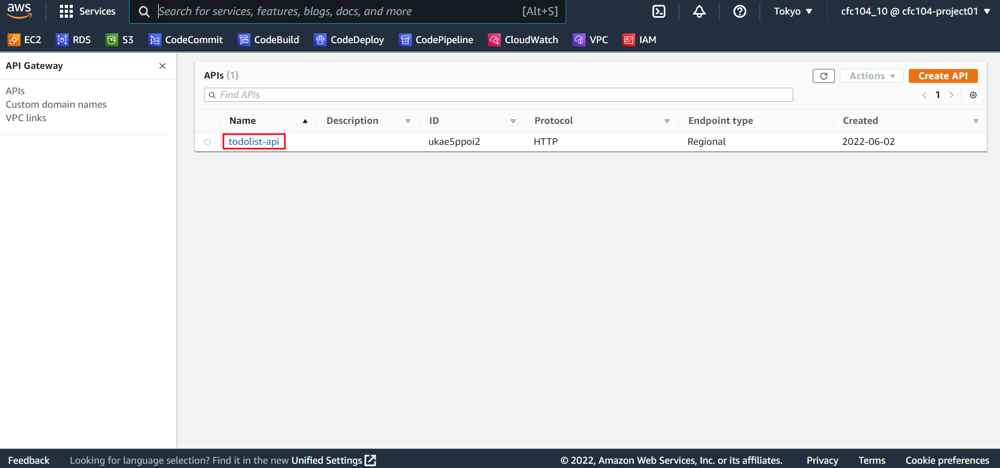

**3. Choose `Routes`.**

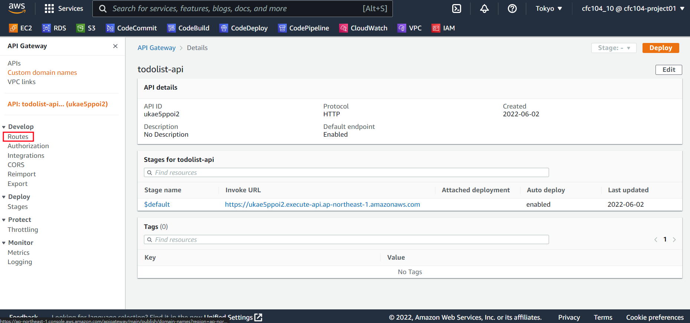

**4. Choose `Create`.**

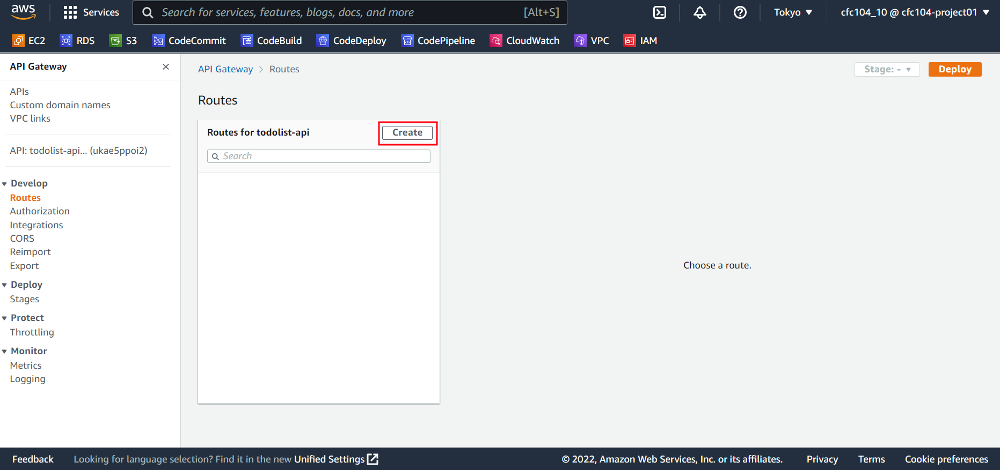

**5. For `Method`, choose `GET`.**

**6. For the path, enter `/items/{id}`. The `{id}` at the end of the path is a path parameter that API Gateway retrieves from the request path when a client makes a request.**

**7. Choose `Create`.**

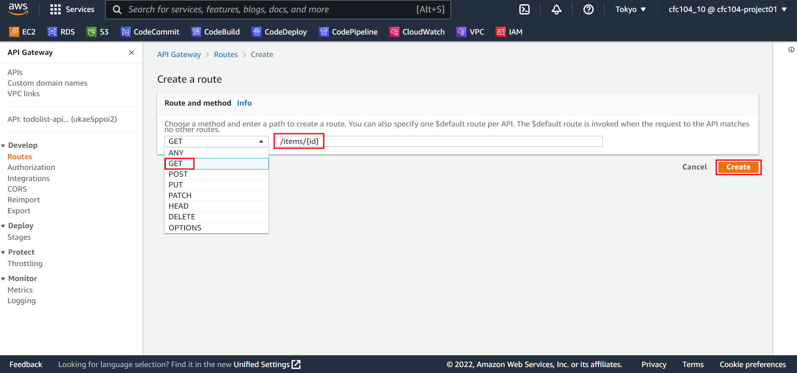

**8. Repeat steps 4-7 for `GET /items`, `DELETE /items/{id}`, and `PUT /items`.**

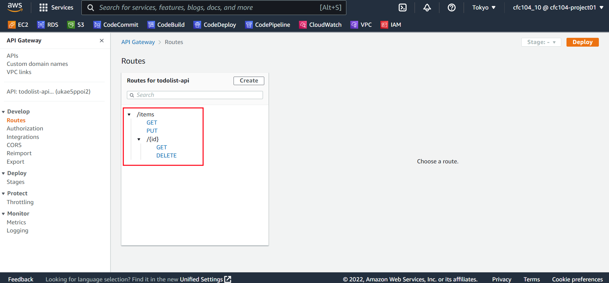

-----

### Step 5: Create an integration
return [Summary](#summary)

> You create an integration to connect a route to backend resources. For this example API, you create one Lambda integration that you use for all routes.

**1. Sign in to the API Gateway console at <https://console.aws.amazon.com/apigateway>.**

**2. Choose your API.**


**3. Choose `Integrations`.**


**4. Choose `Manage integrations` and then choose `Create`.**

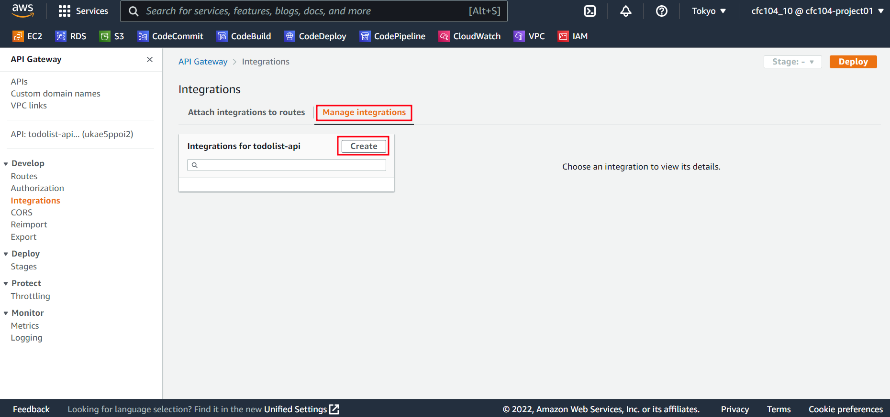

**5. Skip `Attach this integration to a route`. You complete that in a later step.**

**6. For `Integration type`, choose `Lambda function`.**

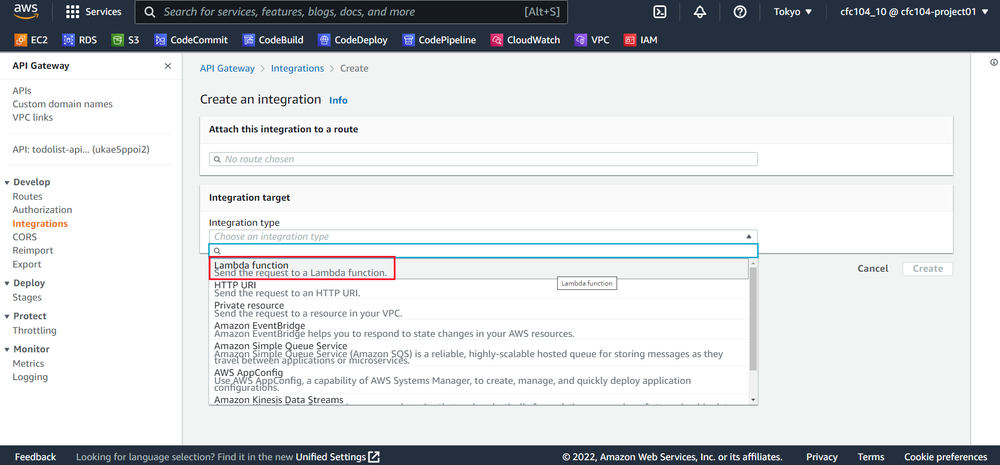

**7. For `Lambda function`, enter `todolist-function`.**


**8. Choose Create.**

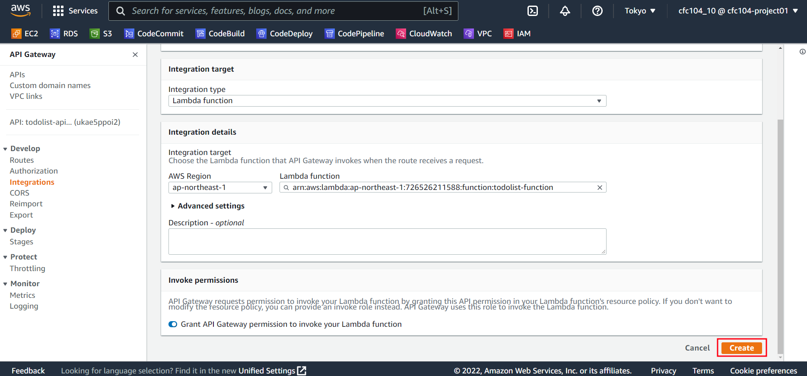

-----

### Step 6: Attach your integration to routes
return [Summary](#summary)

> For this example API, you use the same Lambda integration for all routes. After you attach the integration to all of the API's routes, your Lambda function is invoked when a client calls any of your routes.


**1. Sign in to the API Gateway console at <https://console.aws.amazon.com/apigateway>.**

**2. Choose your API.**

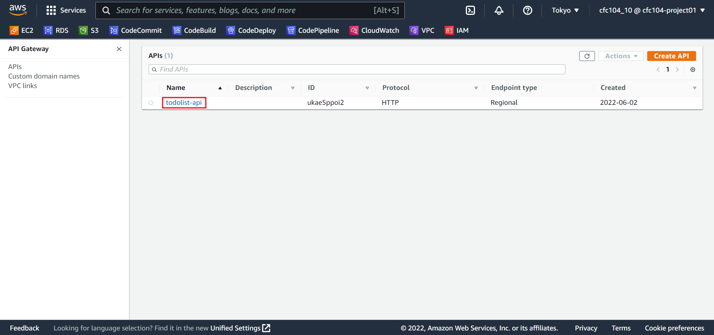

**3. Choose `Integrations`.**

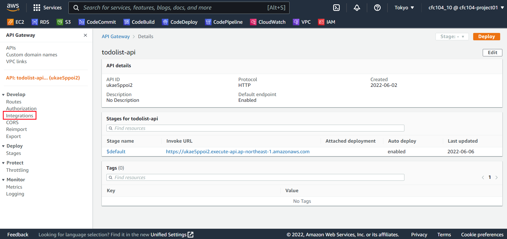

**4. Choose a route.**

**5. Under `Choose an existing integration`, `todolist-function`.**

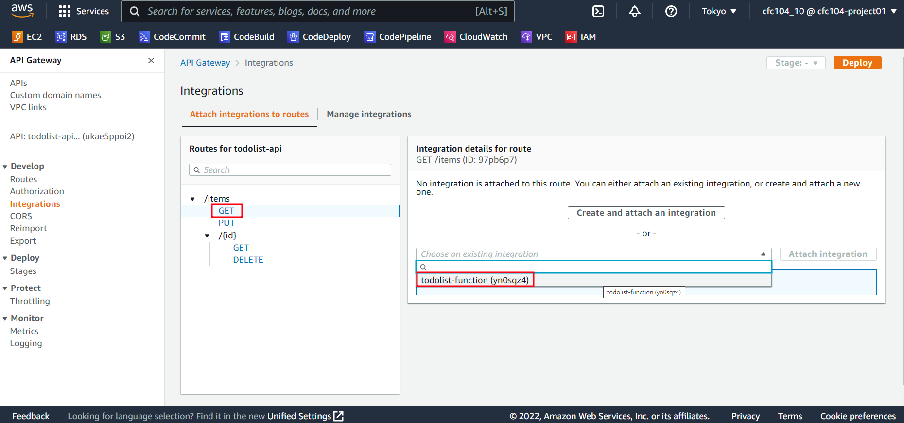

**6. Choose `Attach integration`.**

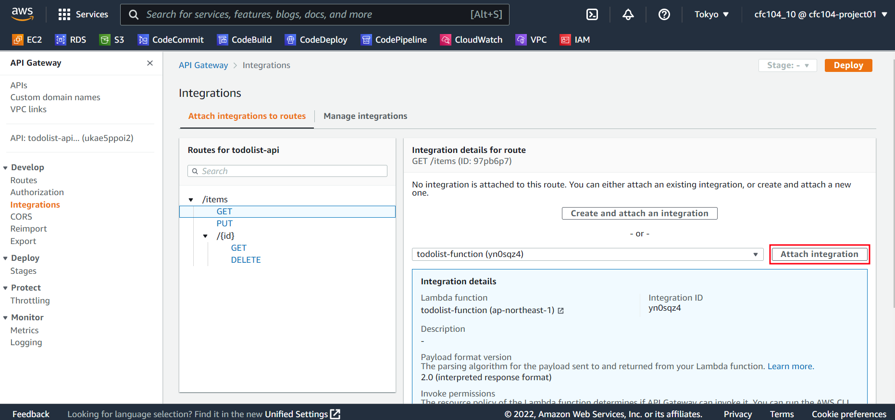

**7. Repeat steps 4-6 for all routes.**

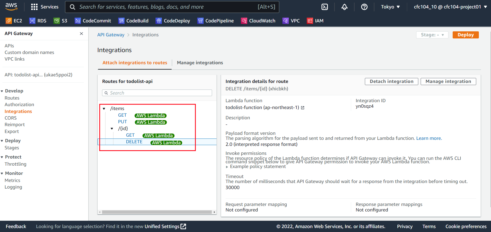

All routes show that an AWS Lambda integration is attached.

-----

### Step 7: Test your API
return [Summary](#summary)

> To make sure that your API is working, you use curl.

**1. Sign in to the API Gateway console at <https://console.aws.amazon.com/apigateway>.**

**2. Choose your API.**

**3. Note your API's invoke URL. It appears under `Invoke URL` on the `Details` page.**

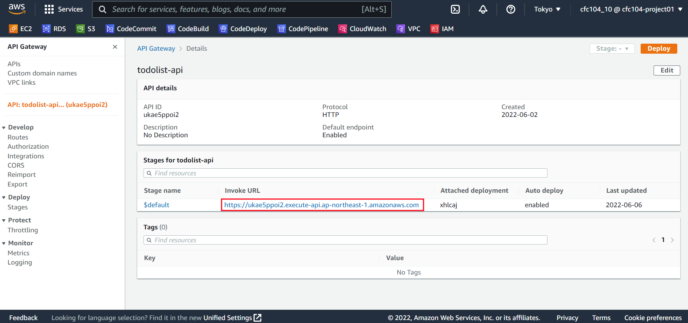

**4. Copy your API's invoke URL.**

The full URL looks like <https://ukae5ppoi2.execute-api.ap-northeast-1.amazonaws.com>.


To create or update an item

- Use the following command to create or update an item. The command includes a request body with the item's ID, price, and name.
```
curl -v -X "PUT" -H "Content-Type: application/json" -d "{\"id\": \"abcdef234\", \"price\": 12345, \"name\": \"myitem\"}" https://ukae5ppoi2.execute-api.ap-northeast-1.amazonaws.com/items
```

To get all items

- Use the following command to list all items.
```
curl -v https://ukae5ppoi2.execute-api.ap-northeast-1.amazonaws.com/items
```

To get an item

- Use the following command to get an item by its ID.
```
curl -v https://ukae5ppoi2.execute-api.ap-northeast-1.amazonaws.com/items/abcdef234
```

To delete an item

1. Use the following command to delete an item.
```
curl -v -X "DELETE" https://ukae5ppoi2.execute-api.ap-northeast-1.amazonaws.com/items/abcdef234
```

2. Get all items to verify that the item was deleted.
```
curl -v https://ukae5ppoi2.execute-api.ap-northeast-1.amazonaws.com/items
```

-----

### AWS 故障排除 - Trouble Shooting
return [Summary](#summary)

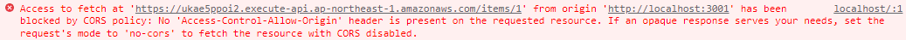

```
Access to fetch at 'https://ukae5ppoi2.execute-api.ap-northeast-1.amazonaws.com/items/1' from origin 'http://localhost:3001' has been blocked by CORS policy: No 'Access-Control-Allow-Origin' header is present on the requested resource. If an opaque response serves your needs, set the request's mode to 'no-cors' to fetch the resource with CORS disabled.
```

Working with HTTP APIs CORS
<https://docs.aws.amazon.com/apigateway/latest/developerguide/http-api-cors.html>


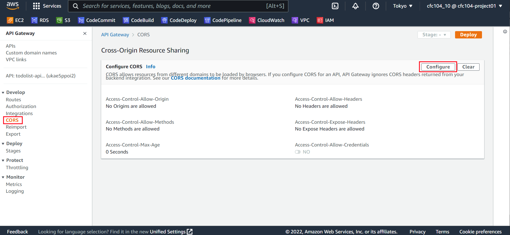

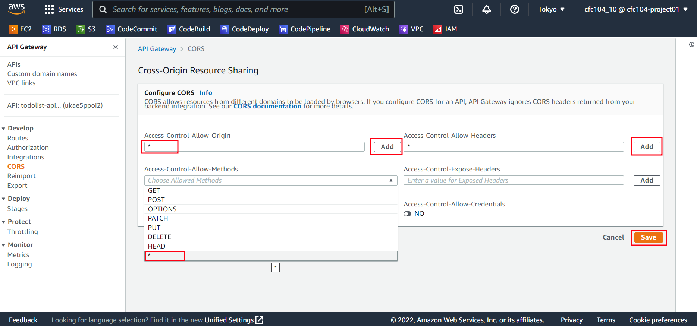

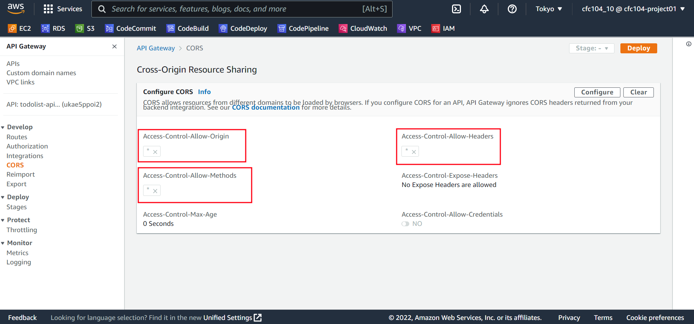


-----

## Reference
return [Summary](#summary)

React 官網
<https://zh-hant.reactjs.org/>


【前端速成】React 快速入門｜Tiktok工程師帶你入門前端｜布魯斯前端
<https://github.com/scps960740/React-crash-course-2021-bruceFE>


用 JSON Server 模擬 RESTful API
<https://medium.com/@debbyji/%E7%94%A8-json-server-%E6%A8%A1%E6%93%AC-restful-api-f07abda3927c>
